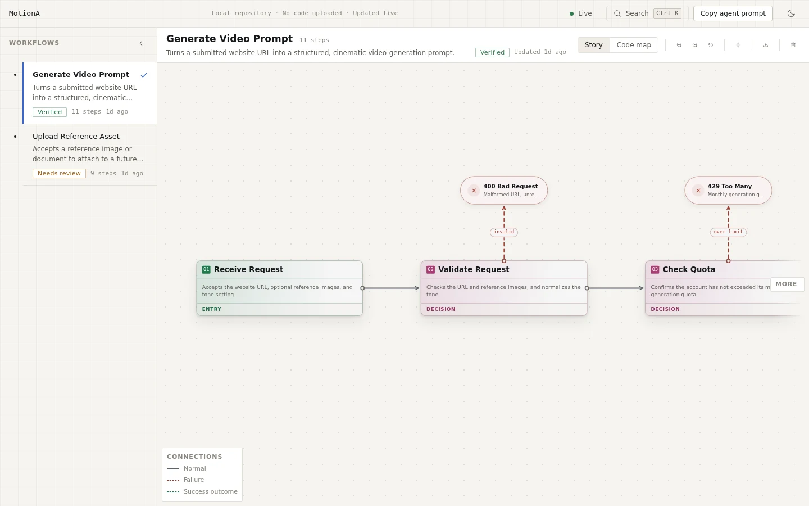

# HQFlow

HQFlow is a local-first web app that renders your coding agent's understanding of
your codebase as an interactive workflow canvas. You run it inside your own repository; your
existing agent (Cursor, Claude Code, Codex, or similar) reads `.codehq/SKILL.md`,
inspects your real source code, and writes structured workflow JSON into `.codehq/`.
HQFlow validates those files, watches them, and renders them in your browser as you
work. **It contains no LLM of its own and never uploads your code anywhere** — everything runs
on `localhost`.

## See HQFlow in action

The image follows your light or dark system theme.

<picture>
  <source media="(prefers-color-scheme: dark)" srcset="./docs/assets/hqflow-canvas-dark.webp">
  <source media="(prefers-color-scheme: light)" srcset="./docs/assets/hqflow-canvas-light.webp">
  
</picture>

## Privacy & security

- Runs entirely on your machine (`localhost`)
- Never uploads repository source to a remote service
- Contains no built-in LLM — your existing coding agent authors the `.codehq` files

See [SECURITY.md](./SECURITY.md) to report vulnerabilities privately.

## The core loop

```
you run `hqflow open`
        |
        v
  browser opens at http://localhost:4310
        |
        v
  you ask your agent: "map the checkout workflow"
        |
        v
  agent reads the repo + .codehq/SKILL.md
        |
        v
  agent writes .codehq/workflows/checkout.json
        |
        v
  HQFlow validates it, writes diagnostics.json
        |
        v
  the board updates live, in your browser, no refresh
```

If the agent writes something invalid, `.codehq/diagnostics.json` explains exactly what
is wrong and how to fix it, and the board keeps showing the last valid version of the workflow
in the meantime — it never blanks out.

## Quickstart

```sh
npx hqflow init
npx hqflow open
```

Then paste this into your coding agent:

> Read `.codehq/SKILL.md`, then document the checkout workflow. It starts at the
> `POST /api/checkout` route. Trace it through order creation, payment, and confirmation
> email, and write the result to `.codehq/workflows/checkout.json`. Then run
> `hqflow validate` and fix anything it flags.

## Commands

### `hqflow init [--force]`

Scaffolds `.codehq/` in the current repository: `project.json`, `SKILL.md`, an empty
`workflows/`, and an initial `diagnostics.json`. Also appends `.codehq/.runtime/` to your
`.gitignore` (creating it if needed, never duplicating the line).

`workflows/` starts empty. The canvas then shows its guided empty state, where you can copy a
prompt for your coding agent or recheck the files after the agent creates a workflow.

- `--force` — overwrite existing `.codehq` files. Without it, an existing file (for
  example a `SKILL.md` you have already edited) is left untouched and reported as unchanged.

### `hqflow open [--port <n>] [--no-open] [--root <path>]`

Starts the local server and opens the workflow canvas in your browser.

- `--port <n>` — port to listen on. Defaults to `4310`; if it is in use, the next free port is
  tried automatically and the fallback is reported.
- `--no-open` — start the server without opening a browser.
- `--root <path>` — repository root to serve. Defaults to walking up from the current
  directory looking for `.codehq/`, then `.git/`, then `package.json`.

Stop it with `Ctrl+C`.

### `hqflow validate [--root <path>] [--json]`

Validates everything under `.codehq/`, writes the result to
`.codehq/diagnostics.json`, and prints it. Exits non-zero if there are any errors.

- `--root <path>` — repository root, same resolution rules as `open`.
- `--json` — print only the `DiagnosticsReport` as JSON, so an agent (or a script) can parse
  the result without scraping human-readable text.

Also available: `--help`, `--version`, `--debug` (or `HQFLOW_DEBUG=1`) for full stack
traces on error.

## The `.codehq` format

```
.codehq/
├── project.json          # project id/name and a few display settings
├── SKILL.md               # instructions for the agent authoring workflows
├── diagnostics.json        # written by HQFlow, read by agents
├── workflows/
│   └── <id>.json           # one workflow per file
└── .runtime/                # gitignored scratch space, ignored by validation
```

A workflow is a directed graph of steps an agent has verified against the real code — no
coordinates, colors, or styling, ever; HQFlow owns all of that. A short annotated
example:

```json
{
  "schemaVersion": "0.1",
  "id": "checkout",
  "name": "Checkout",
  "purpose": "Takes a cart to a confirmed, paid order.",
  "entryPoint": { "file": "app/api/checkout/route.ts", "symbol": "POST" },
  "steps": [
    {
      "id": "create-order",
      "name": "Create Order",
      "purpose": "Persists a pending order from the cart contents.",
      "category": "entry",
      "confidence": "verified",
      "sources": [{ "file": "app/api/checkout/route.ts", "symbol": "POST", "line": 12, "endLine": 30 }],
      "outputs": [{ "name": "Order", "type": "Order" }]
    },
    {
      "id": "charge-payment",
      "name": "Charge Payment",
      "purpose": "Charges the customer's saved payment method.",
      "category": "external",
      "externalServices": [{ "name": "Stripe", "operation": "POST /charges" }],
      "edgeCases": [{ "name": "Card declined", "handling": "Order is marked failed; customer is notified." }]
    }
  ],
  "connections": [
    { "from": "create-order", "to": "charge-payment", "type": "success" }
  ]
}
```

Every object is validated strictly — an unrecognized key (especially a visual one like `x`,
`color`, or `style`) is a hard error, not a warning. Every `file` path must be
repository-relative. The full field-by-field reference lives in `.codehq/SKILL.md` after
you run `init`.

## Local development

```sh
pnpm install
pnpm dev            # web (Vite) + API server, in parallel
pnpm build          # dist/node, dist/web, and dist/export-viewer
pnpm test           # vitest
```

Other useful scripts: `pnpm typecheck`, `pnpm lint`, `pnpm test:e2e` (Playwright).

## Contributing

PRs are welcome — please target `dev`. See [CONTRIBUTING.md](./CONTRIBUTING.md). Direct
pushes to `main` and `dev` are blocked; changes land through pull requests.

## License

[MIT](./LICENSE)
